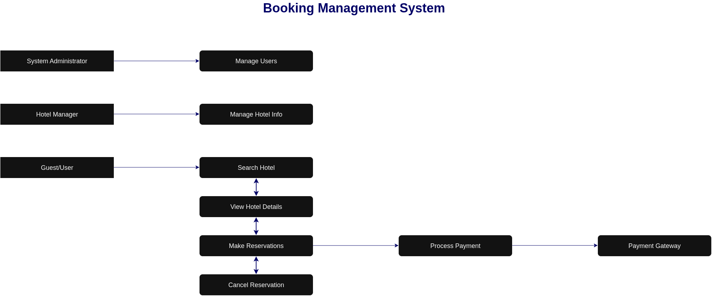

# Requirement Analysis in Software Development

## 📌 Introduction
The Requirement Analysis Project focuses on crafting a comprehensive foundation for software development by documenting, analyzing, and structuring requirements. Through a series of well-defined tasks, this will create a detailed blueprint of the requirement analysis phase for a booking management system. This project simulates a real-world development scenario, emphasizing clarity, precision, and structure in defining requirements to set the stage for successful project execution.

## 💡 What is Requirement Analysis?

Requirement Analysis is the process of identifying, documenting, and validating what a software system must do to meet stakeholder needs. It involves gathering input from clients, users, and business analysts to clearly define both functional requirements (what the system should do) and non-functional requirements (how the system should perform, e.g., security, performance, scalability).

 *Importance in SDLC:*

- Acts as the foundation for design, development, and testing.

- Ensures all stakeholders share a common understanding of project goals.

- Reduces scope creep, rework, and cost overruns.

- Improves software quality by addressing real user needs.

## 💡 Why is Requirement Analysis Important?

- **Clarity of Goals**: Ensures all stakeholders agree on what the software should achieve.

- **Foundation for Design & Development**: Provides a blueprint for building the system correctly.

- **Cost & Time Efficiency**: Prevents unnecessary rework, scope creep, and delays.

- **Quality Assurance**: Helps deliver software that meets real user needs and expectations.

- **Risk Reduction**: Identifies potential challenges early in the SDLC.

*🔑 Three key reasons why requirement analysis is critical in the SDLC*

- **Clear Understanding of Needs** : It ensures developers and stakeholders share the same vision of what the software should achieve, preventing confusion and misaligned goals.
- **Efficient Use of Resources** : By identifying requirements early, teams avoid unnecessary rework, saving time, cost, and effort during later stages of development.
- **Improved Software Quality** : Well-defined requirements guide design, coding, and testing, ensuring the final product meets user expectations and performs reliably.

## 🔑 Key Activities in Requirement Analysis.
- **Requirement Gathering**: Collecting needs and expectations from stakeholders, users, and clients.

- **Requirement Elicitation**: Using techniques like interviews, surveys, and workshops to draw out detailed requirements.

- **Requirement Documentation**: Recording requirements in clear, structured formats (e.g., SRS – Software Requirement Specification).

- **Requirement Analysis and Modeling**: Examining requirements for feasibility, consistency, and completeness, often representing them with models or diagrams.

- **Requirement Validation**: Ensuring documented requirements align with stakeholder needs and are achievable within scope and constraints.

## Types of Requirements

 ### ⚙️ Functional Requirements and its examples

   Functional requirements are the requirements that describe what the system should do, like the core services and features users interact with.    

   #### 🔖 Examples         

- 👁️ **View details** : See hotel and room info such as availability, features, and pricing.

- 🔍 **Users search and book hotels** :Find hotels/rooms by city, date, price, and amenities.

- 🔔 **Send booking notification** : Notify users and hotel managers about reservations.

- 🚫 **Avoid double booking** : Ensure the same room isn’t booked twice for the same time.

- 🗂️ **Manage hotel data & inventory** : Add, update, or remove hotels, rooms, and pricing.      

 ### ⚡  Non Functional requirements  and its examples 
   Non Functional requirements define how the system should perform and behave, covering quality, performance, and reliability.

   #### 🔖 Examples

- 📈 **Scalability**: Support millions of users and bookings simultaneously.

- 🔄 **Consistency**: Maintain strong data consistency even under high concurrency.

- ♻️ **High Availability & Fault Tolerance**: Ensure uptime (e.g., 99.99%) and resilience against failures.

- ⚡ **Performance**: Provide fast responses (e.g., search results under 500 ms).

## 🎭 Use Case Diagrams

A Use Case Diagram is a visual representation of how users (actors) interact with a system to achieve specific goals. It shows the system’s functional requirements by outlining different scenarios (use cases) where a user communicates with the system.

 *🔑 Key Elements:*

- 👤 **Actors**: Users or external systems that interact with the application.

- 🟢 **Use Cases**: Actions or services the system provides (e.g., “Book Room,” “Make Payment”).

- ⬜ **System Boundary**: Defines the scope of what the system will handle.

- 🔗 **Relationships**: Connections showing how actors and use cases interact.

    ### ✅ Benefits of Use Case Diagrams

- 📌 __Clarify Requirements__: Help stakeholders and developers understand system functionality at a glance.

- 🧭 __Define System Scope__: Clearly identifies what is inside or outside the system’s responsibility.

- 👥 __Improve Communication__: Provide a simple, visual way for non-technical stakeholders to understand requirements.

- 🛠️ __Guide Design & Testing__: Serve as a foundation for creating detailed system design and test cases.

- ⚡ __Identify User Roles__: Show how different users interact with the system and what features they access.

### Below is the use case diagram illustrating the main actors and their interactions with the system.

## Acceptance Criteria
   ### Importance of Acceptance Criteria in Requirement Analysis
Acceptance Criteria are the conditions that a software feature must meet to be considered complete and acceptable by stakeholders. They serve as a clear checklist for developers, testers, and clients.

   #### *Why they are important:*

- ✅ Clarity: Define what “done” means, reducing ambiguity in requirements.

- 🧭 Guidance: Provide developers with clear targets when implementing features.

- 🧪 Testability: Help QA teams design test cases and verify functionality.

- 🤝 Alignment: Ensure stakeholders, developers, and testers share the same expectations.

- 🚫 Scope Control: Prevents scope creep by limiting development to agreed conditions.

#### 🛒 Example: Checkout Feature – Acceptance Criteria
- ✅ User must be able to review selected rooms, dates, and prices before payment.

- ✅ System must calculate the total cost, including taxes and fees, correctly.

- ✅ Checkout must support at least one secure payment method (e.g., credit card, PayPal).

- ✅ Payment details must be validated before submission (e.g., card number format, expiration date).

- ✅ On successful payment, the system must generate a booking confirmation with unique reservation ID.

- ✅ On failed payment, the user must see a clear error message and be allowed to retry.

- ✅ A notification (email/SMS) must be sent to the user after successful checkout.

- ✅ The booking inventory must be updated immediately to prevent double booking.

